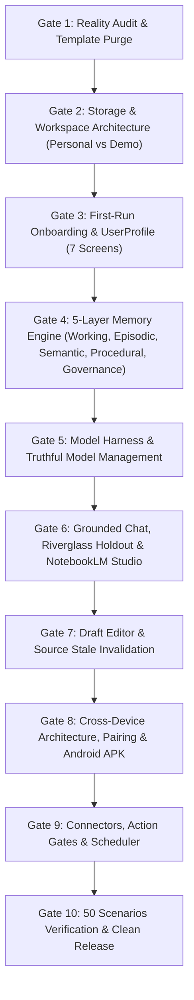

# ATKIN: MASTER DELIVERY PLAN

**Target**: Production-grade sovereign legal workspace (Windows desktop, Android mobile, and web demonstration)  
**Governing Directive**: `D:\movies\ATKIN_MASTER_REPAIR_AND_BUILD_PROMPT.md` & Master Implementation Directive  
**Branch**: `atkin-core`  
**Integration Lead**: Autonomous Senior Architect & Lead Systems Engineer  

---

## 1. Subsystems, Workstreams & Ownership

| Workstream | Scope & Subsystems | Dependencies | Release Gate |
| :--- | :--- | :--- | :--- |
| **WS1: Reality Audit & De-Mocking** | Remove hardcoded template responses, fake fallbacks, purge synthetic contamination from user workspace. | None | Gate 1: Truthful baseline & reproduction |
| **WS2: Storage & Workspace Architecture** | Dual workspace model (Personal vs Demo), UserProfile persistence, Dexie v3/SQLite migrations. | WS1 | Gate 2: Clean empty personal workspace |
| **WS3: Onboarding & First-Run** | 7-screen guided setup: Welcome, Persona, Jurisdiction, Privacy mode, Hardware & AI detection, Preferences, Launch. | WS2 | Gate 3: First 30s & Journey A passed |
| **WS4: Five-Layer Memory Engine** | Working (ContextPlanner), Episodic (Episodes), Semantic (Legal Ontology), Procedural (Skills), Governance (TTL/Supersession/Review). | WS2 | Gate 4: 5-layer memory tests (Amnesia, Isolation, Contradiction) |
| **WS5: Model Harness & Manager** | Accurate model catalog, loopback Ollama & native IPC, hardware detection, smoke test, no fake cloud or fake Gemma tags. | None | Gate 5: Honest model readiness & zero fake fallback |
| **WS6: Grounded Chat & Notebook** | Fix exact clause extraction (Riverglass/Elmbridge holdout), remove irrelevant boilerplates, click-to-source, selective abstention. | WS4, WS5 | Gate 6: Question answering with exact clause quotes |
| **WS7: Editor & Draft Studio** | Autosave, revisions, source change impact warning, DOCX/Markdown export. | WS6 | Gate 7: Draft persistence & stale evidence flags |
| **WS8: Desktop & Mobile Packaging** | Tauri 2 Windows bundle, Android shell/architecture, device pairing protocol, offline matter packs. | WS4, WS5 | Gate 8: Desktop executable, APK artifact, paired protocol |
| **WS9: Connectors, MCP & Actions** | Real connect/disconnect/last-sync, permission broker, confirmation gates before sending/filing. | WS5 | Gate 9: Action preview receipts & safe execution |
| **WS10: Evals & 50 Scenarios** | 50 acceptance scenarios verification report, eval harness, visual QA across 9 viewports. | All | Gate 10: Final proof ledger & release verification |

---

## 2. Release Gates & Execution Sequence

---

## 3. Immediate Implementation Tasks (Current Sprint)

1. **Fix Ingestion & Chat Logic**:
   - Repair `legalReasoningEngine.ts` to directly answer questions without forcing unwanted indemnity/UCTA advice templates when user asks about specific clauses or amounts.
   - Fix `modelBridge.ts` fallback removing the hardcoded Consumer Rights Act goods-failure paragraph.
   - Verify holdout fixture (`Elmbridge Studio / Riverglass Services £2,375 in 17 days`).
2. **Implement UserProfile & Workspace Separation in Storage**:
   - Add `UserProfile` and `Workspace` tables in `src/db/index.ts`.
   - Partition matters into `personal` workspace (initially empty) vs `demo` workspace.
3. **Build 7-Screen Onboarding System**:
   - Welcome -> Persona -> Jurisdiction -> Privacy -> AI Selection -> Preferences -> Start.
4. **Build 5-Layer Memory Subsystem**:
   - Working memory with dynamic context budgeting.
   - Episodic memory with task logs and feedback.
   - Semantic memory with legal ontology (Entity & Relation types) and provenance tracking.
   - Procedural memory with declarative skills and promotion pipeline.
   - Memory governance with TTL, supersession, and review UI.
5. **Add Comprehensive Memory Tests**:
   - Amnesia test, Contradiction test, Staleness test, Skill promotion test, Matter isolation test.
